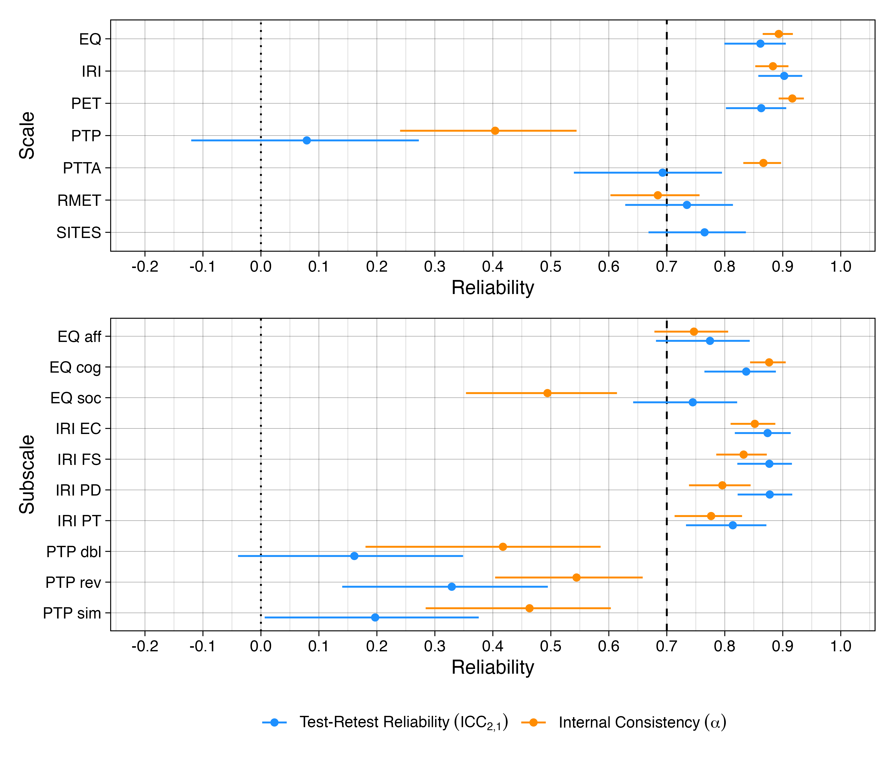

# MASTER NOW ON GOOGLE DOCS !

# The RFT Perspective Taking Protocol has very poor reliability and convergent validity with other measures of perspective taking, empathy, and theory of mind: A jingle assessment

**Ian Hussey¹**, [CO-AUTHORS]

¹ [AFFILIATION] · *Corresponding author:* [EMAIL]

*Target journal:* Journal of Contextual Behavioral Science (Empirical Brief)
*Preregistration:* [OSF LINK] · *Data, materials, and code:* [OSF/GITHUB LINK] · *Word count:* [WORD COUNT]

---

## Abstract

Relational Frame Theory (RFT) conceptualises perspective taking and related constructs of empathy, theory of mind, and false-belief understanding in terms of deictic relational responding. RFT's Perspective Taking Protocol was originally developed to assess and train these relational repertoires, and increasingly became used to measure individual differences in in perspective taking in adult and clinical samples. This slippage was recently raised as a concern regarding its appropriate use: the latter presupposes that PTP scores are reliable and valid measure of a perspective-taking trait, yet these properties have rarely been tested. This puts it at risk of jinge fallacy: the assumption similarly named measures measure similar things. We administered a 9-item PTP to 134 adults online, retesting 98 participants after a 10-day interval, alongside established self-report and behavioural measures of perspective taking, empathy, and theory of mind. The PTP showed poor internal consistency (α = .40) and test–retest reliability indistinguishable from zero (ICC₂,₁ = .08, 95% CI [−.12, .27]); its trial-type subscales did not cohere; and it was essentially uncorrelated with existing measures even after disattenuating for unreliability. A meta-analysis demonstrated that the PTP is on average unrelated to other measures (*r* = .01, disattentuated *r* = .XX) whereas those measures are generally associated with one antoher (*r* = .28, disattentuated *r* = .XX). Results question whether the PTP should be used as a measure of individual differences in perspective taking; naming it a perspective-taking measure may represent a jingle fallacy.

**Keywords:** perspective taking; deictic relational responding; relational frame theory; reliability; convergent validity; jingle fallacy

---

## 1. Introduction

Perspective taking, the related constructs of empathy, theory of mind, and false belief understanding, are important to many aspects of daily life and, as such, have received significant attention in the psychology literature (Hall & Schwartz, 2019). Relational Frame Theory's (REF) conceptualises perspective taking, an indeed related phenomena such as false belief understanding, empathy and theory of mind in terms of deictic relational responding: interpersonal (I–YOU), spatial (HERE–THERE), and temporal (NOW–THEN) (seee Hayes, Barnes-Holmes, & Roche, 2001; McHugh et al., 2004). Perspective taking has received substantial empirical and conceptual attention within RFT research (for reviews, see Kavanagh et al., 2020; Montoya-Rodríguez et al., 2017). 

The protocol originally developed by Barnes-Holmes (2001) to assess and train deictic relations has seen a variety of modifications in subsequent work, and has been referred to by a variety of names including the deictic relations protocol (kavanagh et al), perspective taking protocol (mchugh 2004), the deictic relational task (Watson et al), the Barnes-Holmes protocol (Hendriks), and possibly others. Throught the current article, we refer to it as the perspetive taking protocol (PTP) as this appears to be its most common name. Procedural variations on the task include changes to the complexity of the relational responses included (using some or all of simple, reversed, double reversed relations), the number of trials included, and abstract versus emotional content (see Supplementary Table 1). Importantly, for the sake of this article, its variations have also been used as both a training protocol (with corrective feedback, often in children) versus an assessment measure (with no corrective feedback, often in adults). This article concerns the latter variation of the task, which has been used for example to assess potential perspetive taking deficits in social anhedonia (Vilardaga, Estévez, Levin, & Hayes, 2012; Villatte et al., 2008), psychosis (Hendriks et al., 2016), intelligence and developmental delay (Gore, Barnes-Holmes, & Murphy, 2010), and Borderline Personality Disorder (Walton et al., 2024).

This use of the PTP as an assessment measure makes two, usually implicit, psychometric assumptions: that the sum-scores are a reliable and valid measure of an individual differences trait. Yet, as Kavanagh et al. (2020) emphasise, the protocol was "explicitly designed for developmental purposes". That is, as a training protocol to establish deictic relations in children where they are absent, not to discriminate stably among adults who already possess this repertoire. The properties a training protocol needs to do the first job (i.e., sensitivity to the presence or absence of a repertoire) are not the properties an individual differences measure needs to do the second (i.e., reliable rank-ordering of individuals who generally possess this repertoire). Whether the PTP has the latter properties has, to our knowledge, never been directly tested, despite its wide use in this manner where these psychometric properties are necessary for valid conclusions (see Montoya-Rodríguez et al., 2017 for review). 

This gap sits within a broader reckoning with measurement across psychology. Alongside the Replication Crisis (REF), a parallel Measurement Crisis has highlighted how rarely the validity of our measures is interrogated before they are used to draw conclusions (Flake & Fried, 2020; REFs). The consequences are not hypothetical: widely used scales have been found to harbour hidden invalidity that goes unnoticed precisely because their psychometric properties are assumed rather than checked (Hussey & Hughes, 2020), and there is strong evidence that reliability metrics like Cronbach's alpha are subject to bias and hacking just as *p*-values are (Hussey et al., 2025). Measurement practice also tends toward proliferation of unvalidated measures rather than consolidation towards well-validated ones (REFs). Measures are treated like toothbrushes, with researchers preferring to invent their own rather than reuse others', multiplying the opportunities for the jingle fallacy: the assumption that measures that share similar names measure a similar construct (Thorndike, 1904; Elson et al., 2023). 

Measurement concerns have already been raised for many measures and constructs used in this area. The very widely used Reading the Mind in the Eyes Test (RMET, REF), a measure of theory of mind, has been shown to have very poor measurement properties, to the point that it has been argued it must be retired from use (Higgins et al., 2024, 2025). Within RFT and Contextual Behavioral Science (REF) more broadly, the Implicit Relational Assessment Procedure has been shown to have very poor reliability, which places a hard mathmathcial bound on the magnitude of correlations that can be reliability observed, greatly increasing necessary sample sizes (Hussey & Drake, 2020). Measures of psycholological flexibility have been shown to have a worryinly low degree of item-content overlap between scales, raising the potential for jingle concerns (Ong et al., REF), and there is evidence of jangle fallacy (the opposite assumption, that measures with different names measure different constructs) among measures of mindfulness, which appear to be redundant with personality factors (Altgassen, REF).

Some concerns regarding the valdiity of the PTP arguably already exist. Hendriks et al. (2016) examined performance on a 62-trial version of the PTP protocol found that it correlated only very modestly with two theory-of-mind tests across clinical (anxiety, psychosis) and healthy samples: correlations with the Faux-pas test (REF) correlated between *r* = .32 to .42, and correlations with the Strange Stories Test (REF) were between *r* = .28 to .33. Notably, these correlational magnitudes are lower than would typically be accepted as evidence of convergent validity, and furthermore the correlations with the Strange Stories Test became non-signficiant when IQ was controlled for. This finding that the PTP is associated with IQ has been demonstrated elsewhere (Gore et al., 2010) and represents a strong risk of confounding to the PTP's interpretation.

This study therefore tested a 9-item version of the Perspective Taking Protocol's psychometric properties. Specifically, its internal concistency, its 10-day test-retest reliability, and its convergent validity with other well-established self-report and behavioral measures of perspective taking, theory of mind, and empathy. These broader constructs of theory of of mind an empathy were included on the basis that conceptual RFT work frequently claims that deictic relational responding forms the basis of these other behavioral repertoires (see Kavanagh et al., 2020). 

## 2. Method

Full materials, scoring, analysis code, and the processed data are available at [OSF/GITHUB LINK]. The PTP-relevant details are given below.

### 2.1 Participants

Adults were recruited online via Prolific (prolific.co), with native English and age ≥ 18 as eligibility criteria, and compensated £9 for completing both waves. At Time 1, 134 participants provided usable data (2 excluded for failing embedded attention checks); 98 were retested at Time 2 after a 10-day interval (a further 2 excluded based on attention checks). The Time 1 sample averaged 38.2 years of age (SD = 13.0, range 19–75) and was 67.9% female, 31.3% male, and 0.7% non-binary. Ethical approval was granted by Ruhr University Bochum.

### 2.2 The Perspective-Taking Protocol

We administered a computer-based, forced-choice version of the McHugh et al. (2004) PTP implemented in Qualtrics. It consisted of 9 trials: 3 simple, 4 reversed, and 2 double-reversed. Each trial was scored correct (1) or incorrect (0); we computed a total score (0–9) and three trial-type subscale scores.

### 2.3 Comparison measures

Participants completed a battery of established self-report and behavioral measures spanning perspective taking, theory of mind, and empathy. 

*Self-reports.* The Interpersonal Reactivity Index (IRI; Davis, 1983; 28 items), scored as both a total and four 7-item subscales (Perspective Taking, Fantasy, Empathic Concern, and Personal Distress). The Empathy Quotient (EQ; Baron-Cohen & Wheelwright, 2004; 40 scored items), scored as a total score and, following Lawrence et al. (2004), as cognitive-empathy, emotional-reactivity, and social-skills subscales. The Pictorial Empathy Test (PET; Lindeman et al., 2018; 7 items), as a measure of affective empathy. Lastly, the Single Item Trait Empathy Scale (SITES; Konrath et al., 2018), a single-item global empathy measure.

*Behavioral tasks.* The Reading the Mind in the Eyes Test (RMET; Baron-Cohen et al., 2001; 36 items), a test intented to measure theory of mind. Additionally, the Perspective-Taking Task for Adults (PTT-A; [CITATION]; 32 items), a behavioral measure of visual perspective taking. This was included on the basis of prior findings that spatial and perspective taking may be related individual differences variables (Erle & Topolinski, 2015).

### 2.4 Analysis

Internal consistency was estimated as Cronbach's α (raw α with Feldt 95% CIs) on Time 1 data only. Test–retest reliability was estimated as the intraclass correlation coefficient, specifically two-way absolute agreement with single measurement (ICC₂,₁), following Koo and Li (2016). Convergent validity was assessed using Pearson correlations among Time 1 scores. To estimate the relationship between the measures' true (temporally stable) scores, we also disattenuated each correlation for measurement unreliability by dividing it by the square root of the product of the two measures' test–retest reliabilities: $r_{xy}^{\text{corrected}} = r_{xy} / \sqrt{ICC_x \cdot ICC_y}$. This also serves to usefully control for any reduction in reliability due to test length, including the shortening of the PTP compared to its use in other studies. Conclusions from these disattenuated correlations are therefore generalisabile to longer versions of the task.

Finally, to summarise the convergent-validity pattern, we treated each (disattenuated) correlation as an effect size (Fisher *r*-to-*z* transformed, sampling variance $1/(n-3)$) in a multi-level meta-analysis using the metafor R package. This model tested for differences (moderation) between the correlations that involve the PTP with those among non-PTP measures, after excluding within-instrument (part–whole) correlations. We employed cluster-robust standard errors and confidence intervals to account for the non-independence among the estimates. Pooled estimates are reported back-transformed to Pearson's *r*. 

## 3. Results

### 3.1 Reliability

The PTP total score demonstrated poor internal consistency (**α = .40**) and very poor test–retest reliability that was not detectably different from zero (ICC₂,₁ = .08, 95% CI [−.12, .27]). That is, a participant's PTP score at Time 1 carried essentially no detectable information about their score ten days later. All subscales demonstrated poor internal consistency (all **α < .40**), and very poor test-retest reliaiblity (all **ICC₂,₁ < .35**). In contrast, both the self-report and the behavioral comparison measures generally reached or were close to conventionally acceptable cut-offs for reliability on both indices (i.e., > .70; see Figure 1) with the exception of the EQ's social-skills subscale.

The PTP's subscales were found to be internally incoherent: its three trial-type subscales were mutually independent (simple–reversed *r* = .22; simple–double-reversed *r* = .02; reversed–double-reversed *r* = −.08), undermining the interpretability of its total score (see Figure 2). 

**Figure 1.** Reliability of the PTP (total and trial-type subscales) and comparison measures. Points are estimates and horizontal ranges are 95% confidence intervals; the dotted line marks zero, the dashed line marks a common acceptability threshold of .70. The PTP and its subscales sit far below every other measure on both indices.

### 3.2 Convergent validity

The PTP total score was generally uncorrelated with every other perspective-taking measure: IRI-PT (***r* = −.08), EQ-Cog (*r* = −.04), RMET (*r* = .03), and PTT-A (*r* = −.02**). None approached significance (*p* = .37, .68, .75, and .78, respectively; see Figure 2). The same pattern held across the other comparison measures: the PTP total correlated near zero with empathy, theory-of-mind, and perspective-taking measures alike, with no correlation exceeding |*r*| = .11 and none significant (**all uncorrected *p* ≥ .19**; Figure 2, upper panel). 

Disattenuating these correlations for measurement unreliability did not change this conclusion. Correcting each PTP–measure correlation by the test–retest reliabilities of the two measures revealed small or negligable correlations: IRI-PT *r* = −.31, EQ-Cog *r* = −.14, RMET *r* = .12, and PTT-A *r* = −.11. The opposite direction to that expected. The more robust reading is simply that there is too little reliable PTP variance for any true correlation to be recovered. By the same correction, the comparison measures generally conberged, with the exception of the RMET (which has existing converns about its validity) and the PTT-A (which, as a behavioral measure, may be at risk of hidden invalidity now; see **Sacred Cows REF**. See Figure 2 (lower panel).

**Figure 2.** Correlations among all (sub)scales at Time 1: observed Pearson correlations (upper panel); correlations disattenuated for each pair's test–retest reliability (lower panel). Disattenuated values are clamped to [−1, 1] for display; out-of-range cells (the PTP part–whole pairs, inflated by the PTP's near-zero reliability) are reported exactly in the tables in the Supplementary Materials. 

The moderator meta-analysis formalised this contrast. Across the *k* = 114 cross-instrument correlations (52 involving the PTP, 62 among non-PTP measures, excluding within-scale/subscale correlations), correlations involving the PTP or its subscales with the contrast measures pooled at an average *r* = .01, 95% CI [−.01, .04], compared to correlations among the contrast measures having an average *r* = .28 [.19, .37] (moderator *p* < .001). Applying the same analysis to the correlations after disattenuating for test–retest reliability did not narrow the gap: PTP-contrast correlations *r* = .03 [−.04, .10] versus contrast-contrast correlations *r* = .35 [.23, .47] (moderator *p* < .001). Because the RMET itself has poor and contested psychometric properties (Higgins et al., 2023, 2024), as a sensitivity analysis we repeated the meta-analysis excluding every correlation involving it (*k* = 98). Very similar results were observed: contrast-contrast correlations *r* = .31 [.20, .41] and disattentuated correlations *r* = .39 [.25, .52], versus PTP-contrast correlations *r* = .01 [−.01, .04] and disattenutated correlations *r* = .03 [−.05, .11]; both moderator *p*s < .001. Note that because no concerns been raised about the PTT-A's validity prior to this study, we did not exclude it in the sensitivity analysis to avoid merely conditioning on the data. 

## 4. Discussion

A measure used to rank people on perspective taking should rank them consistently and should agree with other measures of the same or similar constucts. The shortened PTP did neither: poor internal consistency, test–retest reliability near zero, trial-type subscales that do not cohere, and no very limited shared variance with four other accepted measures of perspective-taking. While one could argue post hoc that the measurement of deictic relational responding in an RFT sense differs meaningfully from that of perspective taking, empathy, and theory of mind in their social-cognitive sense, existing RFT theorising has clearly argued that deictic relational responding is closely related to these abilities and should therefore correlate with them (Kavanagh et al., 2020). Additionally, when the PTP's reliability is so low, it is not clear that it is capable of measuring any individiual differences variable validity, given that some degree of reliability forms a mathmathical prerequist for validity (see discussion in Hussey, 2025). The most parsimonious reading is that PTP scores are dominated by occasion-specific error rather than any stable property of the person, and that whatever residual signal they contain is unrelated to what other "perspective-taking" or other measures capture. Using the name "perspective taking" for this measure is, on the present evidence, therefore a jingle fallacy.

This is not a wholesale indictment of the RFT account of perspective taking, nor of the deictic-relations analysis. The current results are agnostic to the use of the PTP as a training protocol to establish such repertoires. Rather, it is an indictment of treating a developmental assessment-and-training protocol as an individual-differences measure, without assessment of its measurement properties. This is precisely the slippage flagged by Kavanagh et al. (2020). 

The PTP is not the only widely used behavioural measure for which concerns are raised by this study. The Reading the Mind in the Eyes Test (RMET) — included here as a theory-of-mind benchmark, and itself converging only weakly with the other measures (all |*r*| ≤ .17) has, since this study was run in 2023, also been examined in exactly this way. In a large, demographically representative sample its factor structure fit poorly and its internal consistency was weak (Higgins, Ross, Langdon, & Polito, 2023). Separately, a systematic review of 1,461 studies found that 63% reported no validity evidence whatsoever, prompting the conclusion that RMET scores, and the literature built on them, are "largely unsubstantiated and uninterpretable" (Higgins, Kaplan, Deschrijver, & Ross, 2024), and those authors have since reiterated their recommendation that researchers stop using the test (Higgins, Kaplan, Deschrijver, & Ross, 2025). This parallel sets a useful benchmark. The RMET has attracted far more validation effort than the PTP and is nonetheless judged unfit for purpose, yet on the present data the PTP is less reliable still (α = .40 vs. .68; ICC₂,₁ = .08 vs. .73) while sharing the same near-total absence of convergent validity. If the evidentiary standard that warrants retiring the RMET is the right one, the PTP does not meet it either. Lastly, in contrast with prior results by Erle and Topolinski (2015), spatial perspective taking on the PTT-A was not found to be associated with other forms of emotional perspective taking.

### Limitations

We tested a shortened version of the PTP. A longer protocol with more trials per relation would, following Classical Test Theory, improve reliability by definition. However, it is unlikely to improve the convergent-validity null results. The robustness of the results to dissatentuation for reliability suggests that this lack of convergent validity is likely to generalise to longer versions of the task. This could be examined directly in future studies. The sample was limited to a non-clinical, native-English online panel. Attention checks served to ensure data quality, but the generalisabilty of the results to clinical populations would benefit from future examination. 

### Conclusion

The Perspective-Taking Protocol appears to suffer from the jingle fallacy: naming it a measure of perspective taking does not make it one. Results demonstrated that it has near-zero convergent validity with other measures of perspective taking, theory of mind, or empathy. The Perspective-Taking Protocol was also shown to be extremely unreliable: its internal consistency is low and its test–retest reliability is near zero. It is likely that a longer version of the task would demonstrate higher reliability, given that reliability is a function of task length assuming parallel effects (e.g., absence of fatigue effects etc.); however, increasing task length alone is unlikely to produce a reliable and valid measure. 

## Appendix A. Length of the Perspective-Taking Protocol across adult studies

Number of test trials, and their distribution across the three levels of relational complexity, in published adult administrations of the McHugh/Barnes-Holmes deictic Perspective-Taking Protocol (or close modifications of it), with the present study shown for comparison. Trial counts were taken from the Method section of each source.

| Study | Adult sample | Use of the protocol | Total trials | Simple / Reversed / Double-reversed |
|---|---|---|---:|---:|
| Barnes-Holmes (2001)ᵃ | original (developmental) | training and assessment | 256 | — |
| McHugh et al. (2004) | adults 18–30 (within a 3–30 developmental profile) | developmental-profile assessment | 62 | 8 / 36 / 18 |
| Villatte et al. (2008) | high vs. low social anhedonia | group comparison; correlation with a ToM (Hinting) task | 62 | 8 / 36 / 18 |
| Hendriks et al. (2016) | anxiety, psychosis, controls (*N* = 58) | correlation with ToM tests (Faux-pas, Strange Stories) | 62 | 8 / 36 / 18 |
| Gore et al. (2010) | 24 adults with intellectual disability | correlation with IQ (WASI) and language (BPVS) | 34 | 8 / 18 / 8 |
| Vilardaga et al. (2012) | university students | predictor of social anhedonia (regression) | 50 | 0 / 30 / 20ᵇ |
| Walton et al. (2024) | BPD vs. control (*N* = 112) | group comparison (BPD vs. control) | 48 | 0 / 48 / 0ᵈ |
| **This study** | 134 adults online | reliability and convergent validity | **9** | 3 / 4 / 2ᶜ |

*Notes.* ᵃ Unpublished doctoral protocol; the 256-trial figure is as reported by Kavanagh et al. (2020). ᵇ Vilardaga et al.'s adult Deictic Relational Task included reversed and double-reversed trials only, balanced across five trial-types (≈10 each): three reversed (I–YOU, HERE–THERE, NOW–THEN) and two double-reversed (I–YOU/HERE–THERE, HERE–THERE/NOW–THEN). ᵈ Walton et al. used the same Deictic Relational Task lineage restricted to reversed trials only (48 items spanning the three deictic relations crossed with affective and cognitive scenario dimensions); they found no significant BPD–control difference on the task. ᶜ Designed as a balanced 3 / 3 / 3; one intended double-reversed trial was implemented as a single reversal and is scored as a reversed trial. Related adult studies using the same deictic framework for false-belief or deception tasks rather than the perspective-taking protocol per se (McHugh et al., 2006, 2007a, 2007b) are omitted here; the false-belief reaction-time protocol of McHugh et al. (2007b) comprised 96 trials.
